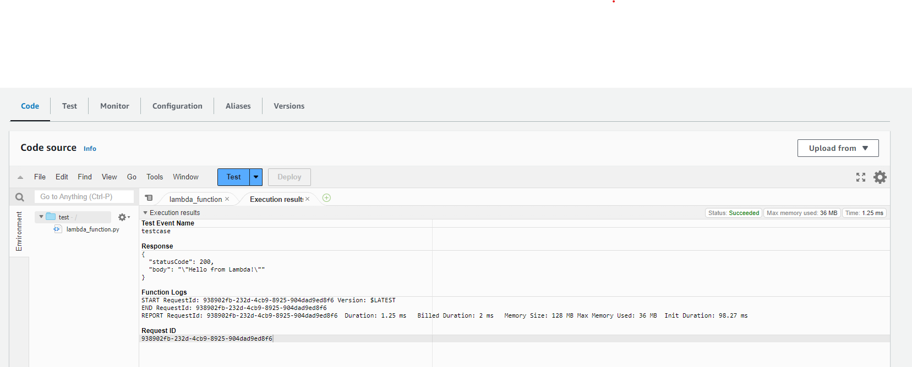
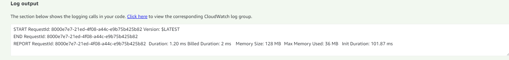

## **Introduction to AWS Lambda Serverless Functions**
Build 2 Lambda functions. 
1 Function from scratch and another using a docker image. 

---

### **What is AWS Lambda?**

```
AWS Lambda is a serverless, event-driven compute service that lets you run code for virtually any type of application or backend service without provisioning or managing servers. You can trigger Lambda from over 200 AWS services and software as a service (SaaS) application, and only pay for what you use.
```
https://aws.amazon.com/lambda/

The USP of serverless functions:

- Pay per use model (measured in duration (ms))
- You don't mange the underlying servers as they are provisioned for you

There are 3 routes to create a Lambda function. I will be exploring the 2 routes that involve us building the function from scratch. 
I will not be covering the 'Use a blueprint' route as it simply builds a lambda function from common use cases. 

1. Author from scratch 
2. Container Image

**Prerequisites** 

* AWS Account
* Docker Desktop Installed 
    * [Windows Guide](https://docs.docker.com/desktop/install/windows-install/)
    * [Linux Guide](https://docs.docker.com/desktop/install/linux-install/)
    * [Mac Guide](https://docs.docker.com/desktop/install/mac-install/)

Finished Links:
- [Github](https://github.com/mo-justlearnai/Introduction-to-AWS-Lambda-Serverless-Functions)

Note: Docker Desktop is free, even for enterprises. Some people think it's not for some reason... what cost money is a dockerhub image registry. It's totally free to have download docker and build and push your docker images to a container registry of your choice. 

## **Author from scratch** 

* Function Name: test (You decide)
* Runtime: Python 3.9 (You decide)
* Architecture: Default
* Execution role: Create a new role with basic Lambda permissions


Let's create a test event by clicking the blue test button to test the boilerplate code.


The test event will be an empty event json. Save it. 


There are 2 ways you can run tests on your lambda function.


1. 
In the Code Tab.



2.
In the Test Tab.


I prefer the Test tab, as you get a larger view of the execution logs of your tests.

Let's customise the function.

Change the lambda_function.py contents to

```python
import json

def lambda_handler(event, context):
    # TODO implement
    
    NAME = event['name']
    
    return {
        'statusCode': 200,
        'body': json.dumps(f'My name is {NAME}')
    }

```

testcase
```json
{
    "name": "Mattithyahu"
}
```

Make sure to Deploy your changes or your function will not update. 


Lastly, let's change our testcase to suit our new lambda function to take in a parameter 'name'. 


*Make sure you save the testcase changes before you click Test!

Result:


```json
{
  "statusCode": 200,
  "body": "\"My name is Mattithyahu\""
}
```
Your testcase output should look like this, with the text you passed to the testcase JSON.

If you haven't noticed already, let me cast your attention to the Log output from our test run. 

I want to highlight the Duration, Billed duration, Memory Size and Max Memory Used outputs.

Duration is essentially the runtime of the test (1.20ms in my case) and the billed duration is the duration rounded up to the nearest 1 ms (2ms in my case). This is a key feature of serverless functions... you only pay for what you use... so, if it's not being used... you're not being charged. 

The Memory size handles all data at run time, variables, and incoming event data. We have a max of 128MB here and we only used 36MB. 




## **Container image** 

If you don't have docker installed, refer to the Prerequisites list above to install Docker for your OS.  

* Function Name: test (You decide)
* Runtime: Python 3.9 (You decide)
* Architecture: Default
* Execution role: Create a new role with basic Lambda permissions

It's out of the scope of this article to cover the basics of docker. I will be publishing a basics of docker article soon. 

To run our lambda function from a docker image, we need a dockerfile that runs our function code with the necessary libraries installed. 

Let's begin

We will start will our lambda function. 

Refer to app.py

**app.py**
```python

# ==================================================
# Title: Lambda function
# Author: Mattithyahu
# Created Date: 26/06/2023
# ==================================================

# Imports test block
# ==================================================
try:
    import json
    import pandas as pd
    import sklearn
    import requests
    import numpy as np

    from warnings import filterwarnings
    filterwarnings('ignore')

except Exception as e:
    print(f"Errors : {e} ")

# Lambda function
# ==================================================
def lambda_handler(event, context):

    print("\n[INFO]: Starting Lambda function..")
    
    NAME = event['name']
    
    return {
        'statusCode': 200,
        'body': json.dumps(f'My name is {NAME}')
    }

```

You're probably wondering what the test block at the top is. 

It's to show the capability of a container image to install many python packages. The test blocks let us know immediately if any of the packages are erroring. I will not be using any of the imported libraries.. it's just a demonstration.

I didn't demonstrate this with the **Author from scratch** method Because it's not very useful in my opinion. 
Layers are a way to add new library capabilities to your lambda function. 


The key downside is that there is a limit to number of layers you can have and there is also a limit to the number of layers. 

A layer is essentially a library like pandas or numpy which are both valid and available layers. The issue arises when you want to use libraries like say opencv-python for which no AWS Lambda layer exists.. so what do you do? 

I haven't found a solution to this, just a better method which is using docker images as you have full autonomy on managing the software infrastructure with a simple pip install, npm install etc
What could be better than docker? (K8. joking... joking - K8 and Docker work in tandem so one can't be better :))

Ok so, our lambda function hasn't changed. It'll still accept a name parameter from out JSON event and return a message 'My name is {NAME}'.


Next is the requirements.txt file that holds the libraries and versions we want our docker image to install. 

**requirements.txt**
```txt
numpy==1.21.5
pandas==1.4.2
scikit-learn==1.0.2
requests==2.28.1
```

Lastly out Dockerfile 
*Btw you can name your Dockerfile as simply Dockerfile but I like to add some extra info to my dockerfile names, so I know what they do. Also because I usually keep many dockerfiles together so it helps to be able to name files accordingly for example.. Dockerfile.react, Dockerfile.django, Dockerfile.node etc..

**Dockerfile.lambda**
```docker
# ==================================================
# Title: Dockerfile w/ Lambda function dependencies
# Author: Mattithyahu
# Created Date: 26/06/2023
# ==================================================

FROM public.ecr.aws/lambda/python:3.9

# Install the function's dependencies using file requirements.txt
# from your project folder.
COPY ./requirements.txt  ./
RUN pip install --upgrade pip 
RUN  pip3 install -r requirements.txt 

# Copy function code to the path to your Lambda function code.
COPY ./app.py ${LAMBDA_TASK_ROOT}
COPY ./app.py ./

# Set the CMD to your handler
CMD [ "app.lambda_handler" ] 

```

The docker file starts will pull from an AWS base image for Lambda. You can also use official docker images too, like official images the AWS base images are preloaded with a language runtime. 

```docker
FROM public.ecr.aws/lambda/python:3.9
```

https://gallery.ecr.aws/lambda/python 
At the above link you will find the ECR public gallery with an array of AWS base images for python in AWS lambda to choose from. 


I then copied the requirements file into the docker image. Upgraded pip and then installed the packages from the requirements file. 

```docker
COPY ./requirements.txt  ./
RUN pip install --upgrade pip 
RUN  pip3 install -r requirements.txt 
```

I copied app.py to the docker image and to the lambda task root which is the path to your lambda function code.
```docker
# Copy function code to the path to your Lambda function code.
COPY ./app.py ${LAMBDA_TASK_ROOT}
COPY ./app.py ./
```

Finally the CMD to be executed when the container is started.
```docker
# Set the CMD to your handler
CMD [ "app.lambda_handler" ] 
```

Ok. Here's what we'll do. 

1. Build Docker Image locally
2. Test it locally
3. Push it to AWS ECR (Elastic Container Registry)
4. Build our lambda function from this image

1. Build Docker Image Locally

Make sure the Docker Desktop Engine is running and open a terminal to build the docker image. 


Run the below command from the root of the repository. 
Note: All files are at the root of the repository.

```
.
├── app.py
├── README.md
├── requirements.txt
└── Dockerfile.lambda

```

```shell
docker build -t lambda:latest -f ./Dockerfile.lambda .
```

2. To test our image locally we first need to run it. 

```shell
docker run -p 9000:8080 lambda:latest
```

This command runs the image as a container and creates a local endpoint at localhost:9000/2015-03-31/functions/function/invocations.

Open another CMD prompt or Shell / Bash window. 

Finally to test it POST JSON data to the local endpoint

```shell
curl -XPOST "http://localhost:9000/2015-03-31/functions/function/invocations" -d '{"name":"Mattithyahu"}'
```

Result:

```JSON
{"statusCode": 200, "body": "\"My name is Mattithyahu\""}
```

In a new terminal, run the below to get the container ID.

```shell
docker ps
```

Run docker kill to stop the container. 
```shell
docker kill
```

3. Push it to AWS ECR (Elastic Container Registry)
This method does not require the installation of the AWS CLI.

Run the below command in an AWS CloudShell

I will be hosting my container registry in the eu-west-2 region. You can choose any region you like, just keep it consistent for any docker and ecr commands you run. 

```shell
aws ecr get-login-password --region eu-west-2
```

You will receive an authentication token to authenticate your Docker client to your registry. 

This token is only active for 12 hours.


Finally in the AWS Cloudshell, let's create a registry to hold our image.

```shell
aws ecr create-repository --repository-name lambda --image-scanning-configuration scanOnPush=true --image-tag-mutability MUTABLE
```

If successful, you see a response like this:

```JSON
{
    "repository": {
        "repositoryArn": "arn:aws:ecr:eu-west-2:[YOUR ACCOUNT ID]:repository/lambda",
        "registryId": "[YOUR ACCOUNT ID]",
        "repositoryName": "lambda",
        "repositoryUri": "[YOUR ACCOUNT ID].dkr.ecr.us-east-1.amazonaws.com/lambda",
        "createdAt": "2023-06-26T06:39:01+00:00",
        "imageTagMutability": "MUTABLE",
        "imageScanningConfiguration": {
            "scanOnPush": true
        },
        "encryptionConfiguration": {
            "encryptionType": "AES256"
        }
    }
}
```

On your local terminal now run

```shell
docker login --username AWS --password [YOUR AUTHENTICATION TOKEN] [YOUR ACCOUNT ID].dkr.ecr
.eu-west-2.amazonaws.com
```

Note: You will receive a warning message that using --password via the CLI is insecure. Use --password-stdin. But this is just a quick work around to not installing the AWS CLI. 

 
Finally, we will re tag the docker image to the AWS ECR standards

```shell
docker tag lambda:latest [YOUR ACCOUNT ID].dkr.ecr.eu-west-2.amazonaws.com/lambda:latest
```

```shell
docker push [YOUR ACCOUNT ID].dkr.ecr.eu-west-2.amazonaws.com/lambda:latest
```


You can view the pushed image in the repository. 


4. Build our lambda function from this image


Select the container image you pushed.


After the lambda function has been created, scroll down, and navigate to configuration and click edit.


Change the Memory and Ephemeral storage to the maximum: 10240 MB and Timeout to 3 minutes. Click Save.

Note! If you receive an error message: 'MemorySize' value failed to satisfy constraint that may mean storage provision in your region is lower than the maximum available. 

For myself 2000MB max worked for the eu-west-2 region. 

Create another testcase:

testcase
```json
{
    "name": "Mattithyahu"
}
```

Run the test.


There isn't anything to clean up in regard to cloud, as Lambda images aren't billable outside of them being run. The image stored in ECR is also within the free tier limits of 500MB free storage. 

But to be safe you can delete the image.

Thanks for reading.

---
<!-- DONE -->
